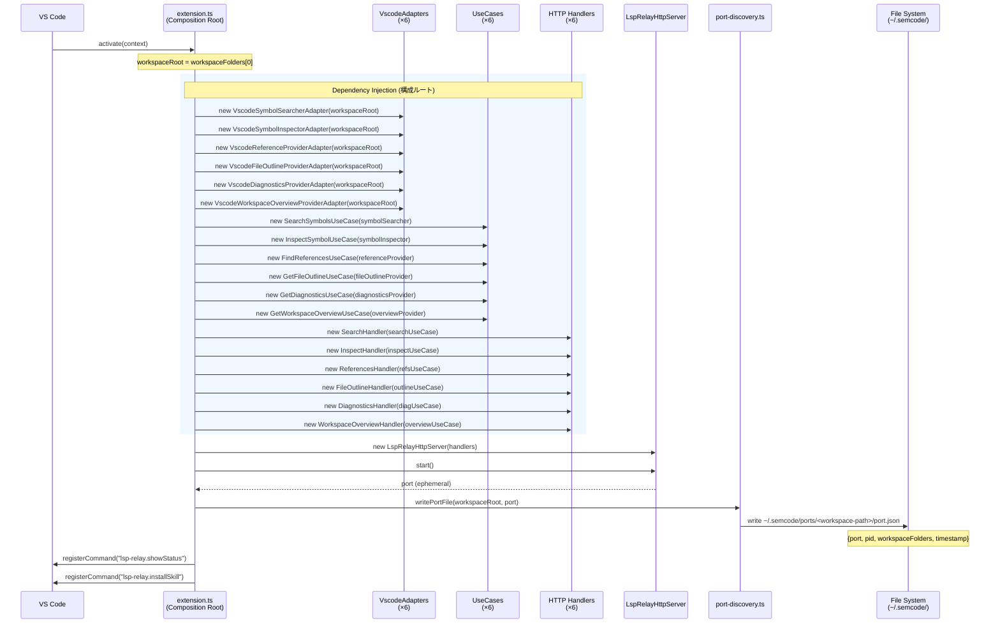
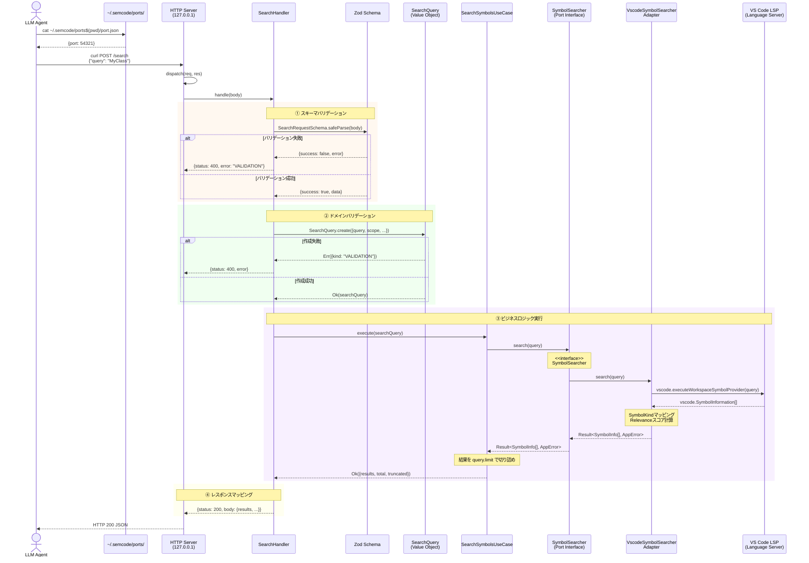
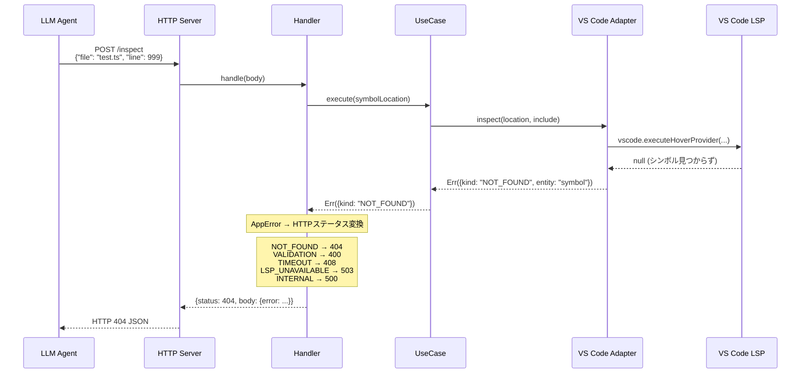
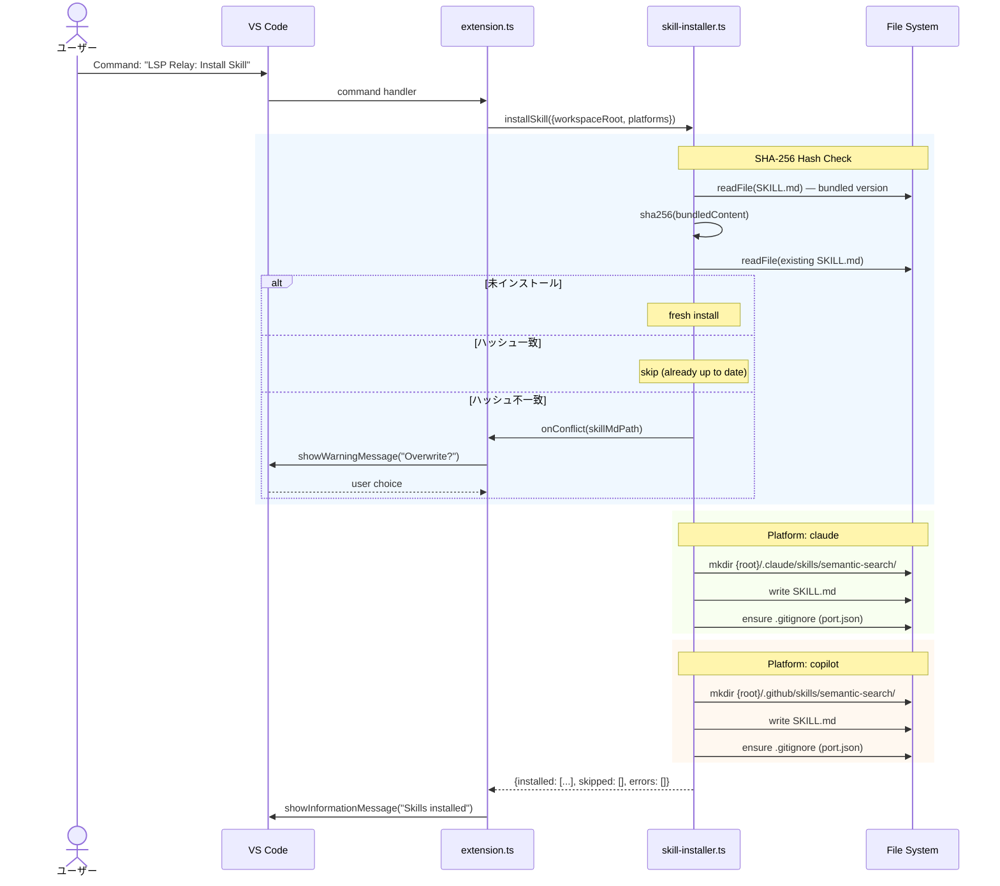
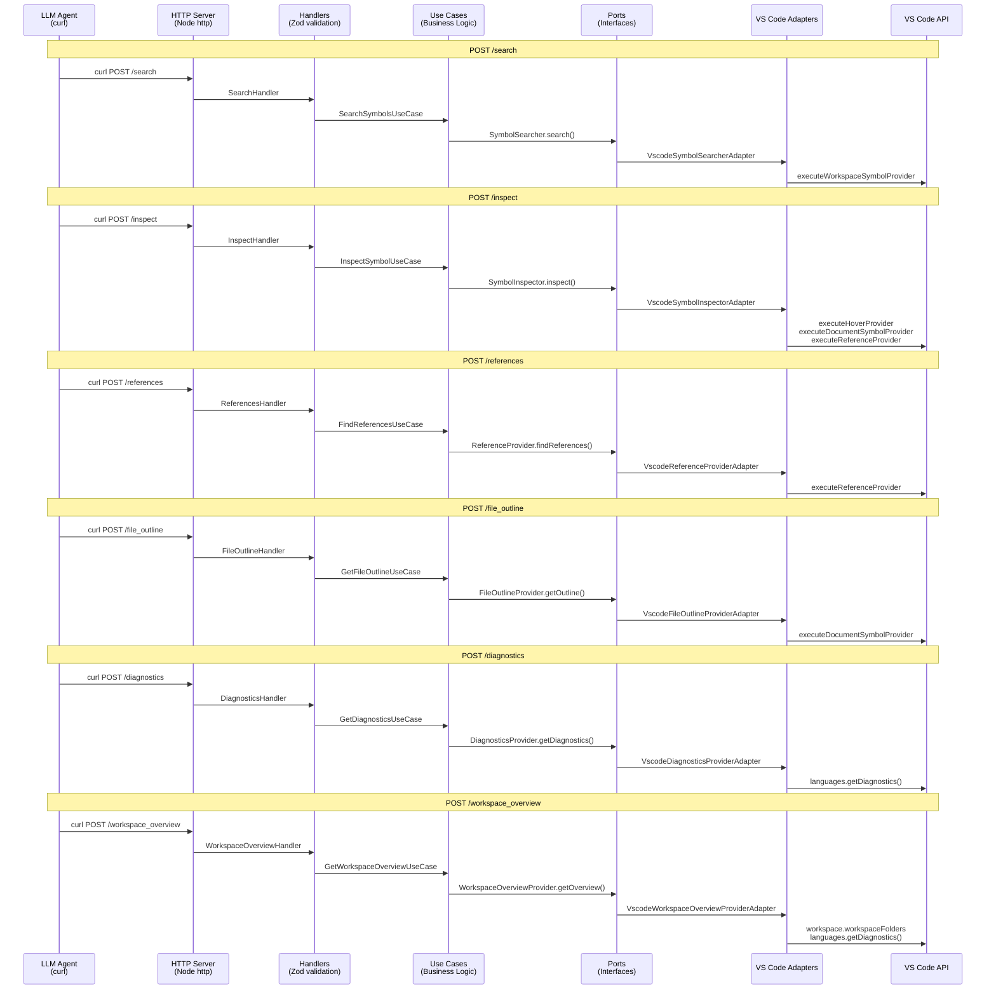
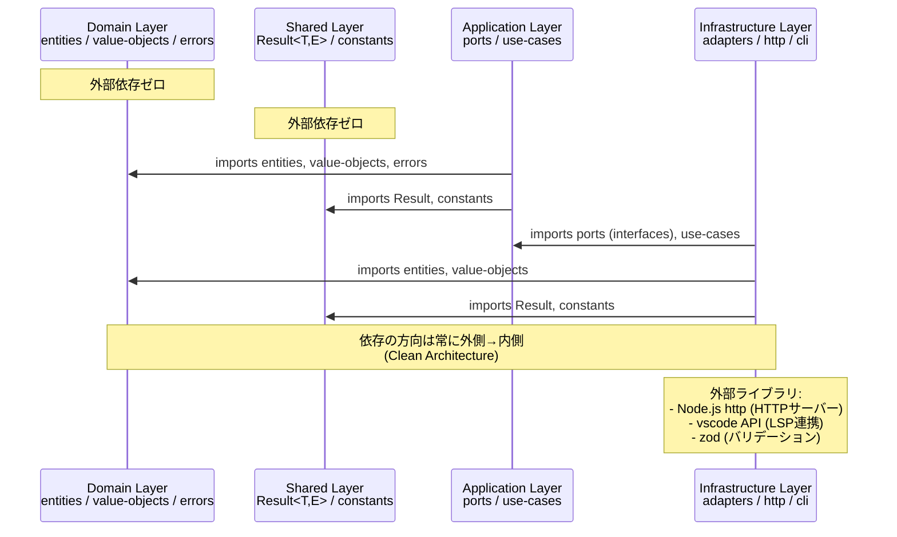

# SemCode シーケンス図

## 1. 拡張機能の起動（Composition Root）

VS Code が拡張機能を読み込み、依存関係を組み立ててHTTPサーバーを起動するまでの流れ。

## 2. APIリクエストの処理フロー（例: /search）

LLMエージェントからのHTTPリクエスト（curl）が処理される典型的な流れ。

## 3. エラーハンドリングフロー

各レイヤーでのエラーがHTTPステータスコードにマッピングされる流れ。

## 4. Skillインストール

スキルファイルのインストールフロー。SHA-256ハッシュで更新チェックを行う。

## 5. 全エンドポイント一覧とレイヤー依存関係

## 6. レイヤー間の依存方向（アーキテクチャ概要）

